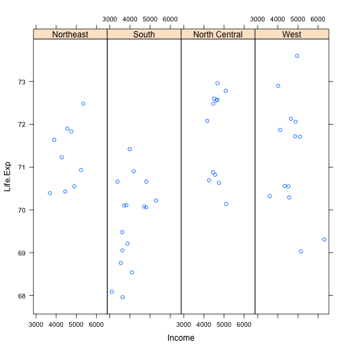
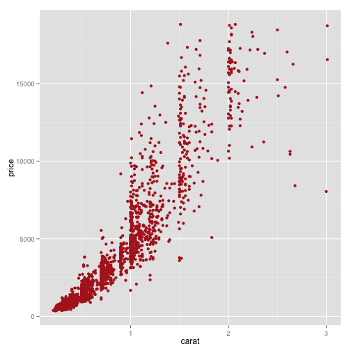
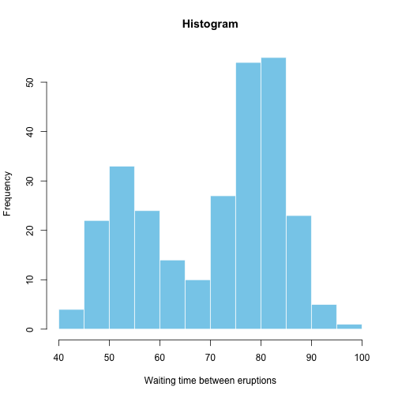

## Different Plots in R

---
* R provides many ways to Visualise our data for analysis. Here are a few:


####  Base Plot

```r
data(cars)
with(cars,plot(speed,dist))
```

 

---
####  Lattice Plot

```r
library(lattice)
state <-data.frame(state.x77,region=state.region)
xyplot(Life.Exp ~Income|region,data=state,layout = c(4,1))
```

 

---
####  ggplot2 system       

```r
library(ggplot2)
data(diamonds)
diamonds<-diamonds[sample(1:nrow(diamonds),2000),]
ggplot(diamonds, aes(carat, price))+geom_point(color="firebrick")
```

 

---

#### Histogram

```r
hist(faithful[,2], breaks = 15, col = 'skyblue', border = 'white',xlab = "Waiting time between eruptions", main = "Histogram")
```

 
---


